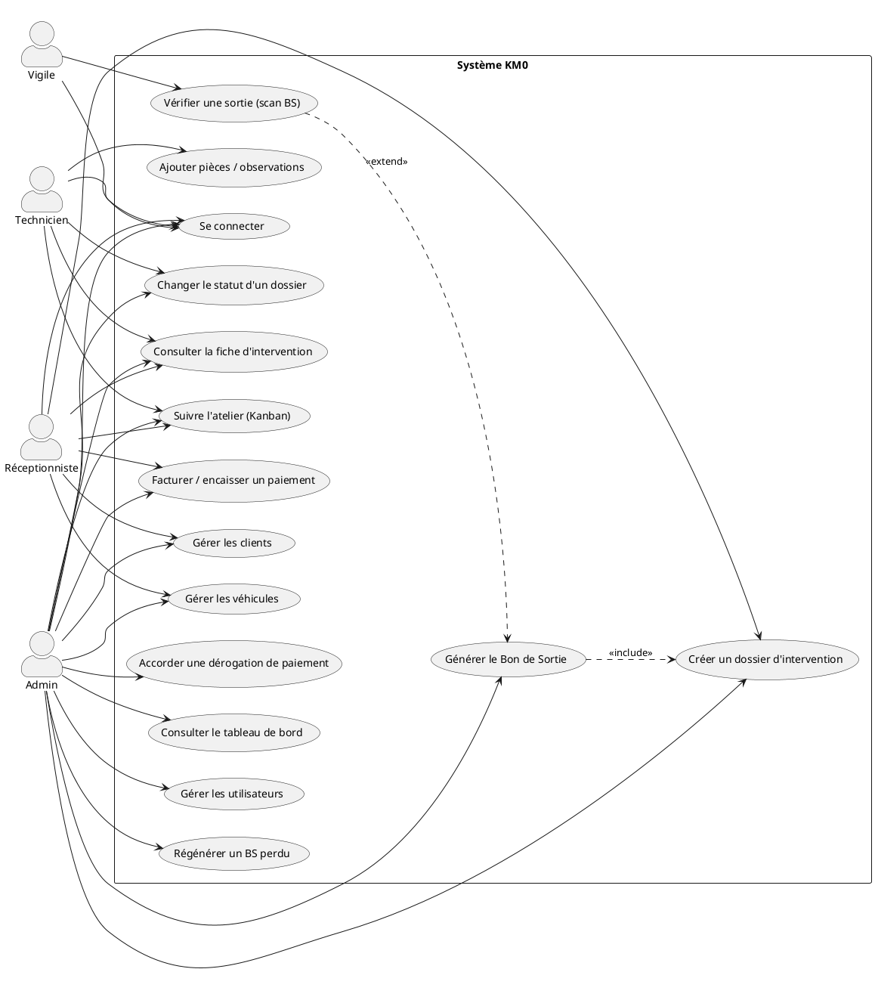
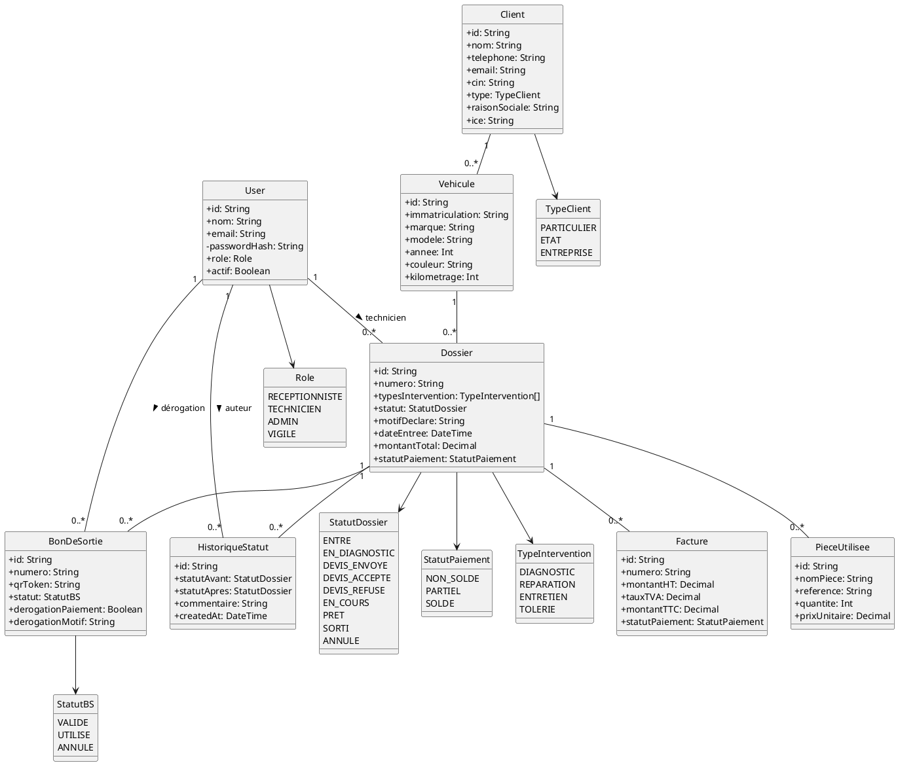

# Images à fournir pour `rapport.tex` (et `cc.tex`)

Ce fichier liste les images que je ne peux pas générer directement par du code LaTeX
(tikz ne rend pas bien les diagrammes UML normalisés). Pour chacune : le nom de fichier
attendu, l'endroit où elle est utilisée dans le `.tex`, et le code source à coller dans un
générateur externe pour produire le PNG.

Une fois les images générées, place-les dans les dossiers indiqués (à créer s'ils
n'existent pas) à la racine du projet, à côté de `rapport.tex` — ce sont ces mêmes
dossiers qu'il faudra uploader sur Overleaf avec le `.tex`.

---

## 1. Logo de l'école (déjà requis par `cc.tex` et `rapport.tex`)

- **Fichier attendu :** `logo.png` (racine du projet, à côté de `rapport.tex`)
- **Utilisé dans :** page de garde des deux documents (`\includegraphics[width=4.6cm]{logo.png}`)
- **Contenu :** logo officiel de l'EMSI (Casablanca — Campus Oranger)
- **Génération :** pas de diagramme ici — récupère le logo officiel (site de l'école,
  charte graphique) et exporte-le en PNG avec fond transparent si possible.

---

## 2. Diagramme de cas d'utilisation

- **Fichier attendu :** `diagrams/diagramme_cas_utilisation.png`
- **Utilisé dans :** `rapport.tex`, chapitre *Analyse et spécification des besoins*,
  section *Besoins fonctionnels* (macro `\diagram{diagramme_cas_utilisation}{0.95}{...}`)
- **Génération :** colle le bloc ci-dessous dans l'éditeur en ligne
  [plantuml.com/plantuml](https://www.plantuml.com/plantuml/uml/) (ou l'extension
  PlantUML de VS Code, ou `plantuml.jar` en local), exporte en PNG, puis renomme le
  fichier `diagramme_cas_utilisation.png`.

---

## 3. Diagramme de classes UML

- **Fichier attendu :** `diagrams/diagramme_classes.png`
- **Utilisé dans :** `rapport.tex`, chapitre *Conception*, section *Modélisation des
  données* (macro `\diagram{diagramme_classes}{0.95}{...}`)
- **Génération :** même procédé que ci-dessus (PlantUML), le diagramme reprend
  fidèlement le schéma Prisma du projet (`prisma/schema.prisma`).

---

## À faire à chaque nouveau diagramme

Quand un futur chapitre du rapport aura besoin d'un diagramme trop complexe pour tikz
(ex. diagramme d'activité pour la machine à états détaillée, diagramme de déploiement),
ce fichier sera complété de la même façon : nom de fichier attendu, emplacement dans le
`.tex`, code PlantUML prêt à coller.
